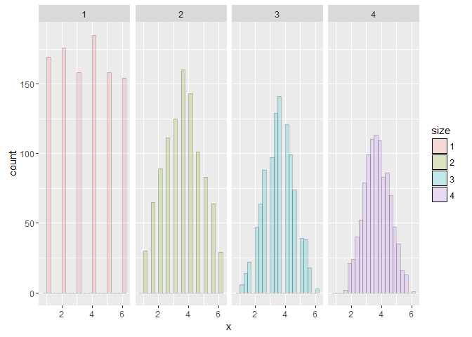

# Simulation Experiment: Standard normals
VM  
Feb 2016  


###Simulation experiment with roll of dies.
###Experiment to prove mean will be concentrated around the popolution mean as the number of experiment increase and resembles bell curve
##For more details 

Shiny is an R pakage 


```r
library(UsingR); data(galton); library(ggplot2); 
```

```
## Loading required package: MASS
```

```
## Loading required package: HistData
```

```
## Loading required package: Hmisc
```

```
## Loading required package: lattice
```

```
## Loading required package: survival
```

```
## Loading required package: Formula
```

```
## Loading required package: ggplot2
```

```
## 
## Attaching package: 'Hmisc'
```

```
## The following objects are masked from 'package:base':
## 
##     format.pval, round.POSIXt, trunc.POSIXt, units
```

```
## 
## Attaching package: 'UsingR'
```

```
## The following object is masked from 'package:survival':
## 
##     cancer
```

```r
nosim <- 1000
dat <- data.frame(
x = c(sample(1 : 6, nosim, replace = TRUE),
  apply(matrix(sample(1 : 6, nosim * 2, replace = TRUE), nosim), 1, mean),
  apply(matrix(sample(1 : 6, nosim * 3, replace = TRUE), nosim), 1, mean),
  apply(matrix(sample(1 : 6, nosim * 4, replace = TRUE), nosim), 1, mean)),
size = factor(rep(1 : 4, rep(nosim, 4))))
```

Plot to show the Mean for different dice rolls
========================================================



Steps to use the application : How to simulate
========================================================
*step 1: Use slider to increase the number dice roll*  
*Step 2: Watch the histogram increase it density around mean*  
*Step 3: and it is evident that mean is same as popoluation mean as sampling size increases*
      
Conclusion
========================================================
This simulation demostrates that the more data that goes into the sample mean, 
the more concentrated its density/mass functions are around the population mean and
the histogram is also centered at 3.5. so it is 3 and 4 and concentrated aroung 3.5 as the simulation increses and resmebled bell curve)

